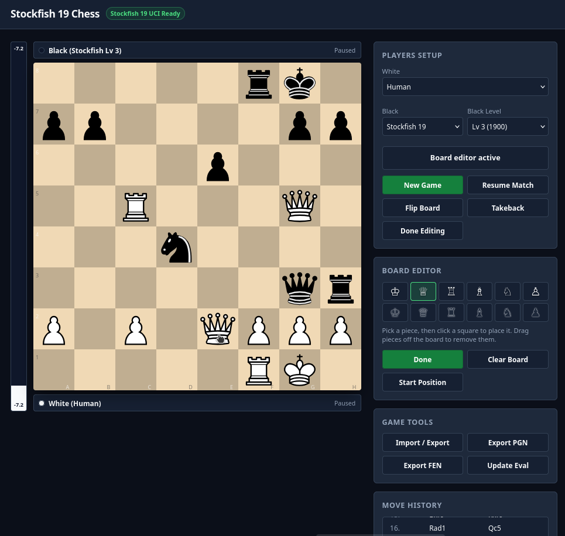

# Stockfish 19 Chess

A web chess game built with Lichess [Chessground](https://github.com/lichess-org/chessground) and native [Stockfish 19](https://github.com/official-stockfish/Stockfish) UCI engine.

<p align="center">
  
</p>

## Quick Start

1. Install dependencies:
   ```bash
   npm install
   ```

2. Build client assets and verify Stockfish binary:
   ```bash
   npm run build
   ```

3. Start server:
   ```bash
   npm start
   ```

4. Open `http://localhost:3000` in your browser.

## Features

- **Lichess Chessground Board**: Smooth piece movement, legal destination highlights, and SVG piece set.
- **Stockfish 19 integration**: Runs a pinned native binary on Linux, macOS, or Windows over the UCI protocol.
- **Flexible Player Setup**: Configure White and Black independently as Human or Stockfish 19.
- **Engine vs Engine**: Watch Stockfish play against itself at different difficulty levels.
- **Live Evaluation Bar**: Displays position advantage in centipawns or mate distance.
- **Import and export**: Load FEN or PGN, preserve PGN variations, copy notation, or download `.pgn` files.
- **Sound Effects**: Move and capture audio synthesized with the Web Audio API.

## Available Scripts

- `npm run start`: Starts the web server at port 3000 (auto-builds if bundle is missing).
- `npm run build`: Bundles client assets with esbuild and downloads the pinned Stockfish 19 binary if missing.
- `npm run test`: Runs integration tests for the app, server, and engine.
- `npm run stockfish`: Downloads Stockfish 19 if it is missing.
- `npm run download:stockfish`: Downloads and verifies a fresh Stockfish 19 binary for the current platform.

The server binds to `127.0.0.1` by default. Set `HOST=0.0.0.0` to allow network access.
Set `STOCKFISH_PATH` to use another Stockfish binary or an unsupported platform.
